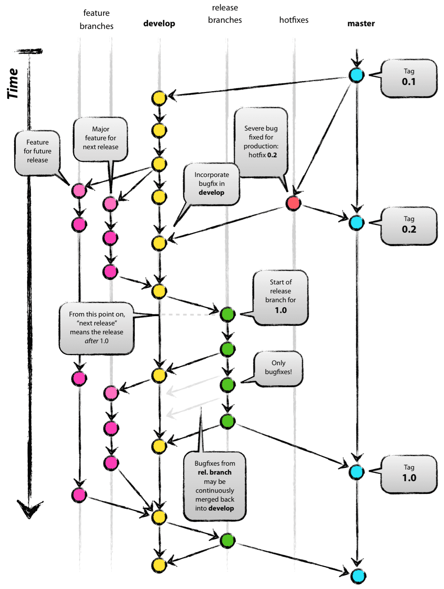

# End to End AI Agent 보안 가시화 (COONTEC Co., Ltd.)

  
  

---

## 목차

1. [OpenClaw (대상 에이전트)](#openclaw-대상-에이전트)
2. [문서와 SSOT](#문서와-ssot)
3. [구현 현황 (요약)](#구현-현황-요약)
4. [참고: Git-flow](#참고-git-flow)
5. [참고: 커밋 메시지](#참고-커밋-메시지)

---

## OpenClaw (대상 에이전트)

🦞 Personal AI Assistant · [github.com/openclaw/openclaw](https://github.com/openclaw/openclaw)

OpenClaw는 LLM을 기반으로 실제 작업을 수행하는 오픈소스 AI Autonomous Agent입니다.

| 영역 | 설명 |
|------|------|
| 추론·의사결정 | 다양한 LLM을 활용합니다. |
| 도구 실행 | LLM이 선택한 **tool**로 셸 명령, API 호출 등을 자동 수행합니다. |
| 메모리 | 실행 행동이 **Memory**에 쌓여 **컨텍스트**를 유지하고, 장기·복잡 작업을 이어 갑니다. |

에이전트가 툴로 작업을 진행하기 때문에, **오판이나 악의적 지시**로 인해 시스템 손상·보안 위협이 생길 수 있습니다. 이 프로젝트는 사용자가 OpenClaw를 더 안심하고 쓸 수 있도록 **취약점 스캔·LLM 오판 방어**를 담은 보안 MVP를 지향합니다.

---

## 문서와 SSOT

| 문서 | 용도 |
|------|------|
| [docs/test-bed-dgx-spark.md](docs/test-bed-dgx-spark.md) | 추론: **NVIDIA DGX Spark**, 게이트웨이 연결·검증 |
| [docs/sentinel.md](docs/sentinel.md) | Python Sentinel 정책, 오탐, `sessions.abort` 가드 |

---

## 구현 현황 (요약)

아래는 저장소에 반영된 **스캐폴드·도구**만 요약합니다. 상세 범위는 플랜을 따릅니다.

### 시나리오

- 디렉터리: `scenarios/`
- 카탈로그: [scenarios/catalog.yaml](scenarios/catalog.yaml)
- 예: S1 플러그인 공급망 시나리오 등

### Python `scripts/`

설치·실행: [scripts/README.md](scripts/README.md) (venv, `PYTHONPATH=scripts`, 예시 커맨드)

| 구성요소 | 역할 |
|----------|------|
| `scripts/openclaw_ws.py` | 게이트웨이 WebSocket 공용 클라이언트 (`connect`, `rpc`, 이벤트) |
| `scripts/sentinel/ingest.py` | 구독·정규화·append-only `data/trace.jsonl`, 시작 시 `tools.effective` / `tools.catalog` 스냅샷 |
| `scripts/sentinel/detect.py` | `rules/*.yaml`, `trace.jsonl`, 베이스라인 대비 `tools.effective` diff → findings JSON |
| `scripts/sentinel/respond.py` | stderr 알림, `data/findings-latest.json`, 선택 웹훅, 문서화된 조건에서만 `sessions.abort` |
| `scripts/runner/send_scenario.py` | `OPENCLAW_GATEWAY_*` 등으로 접속, 기본 `chat.send` 시나리오 주입 (`OPENCLAW_CHAT_SEND_PARAMS_JSON`로 params 조정 가능) |
| `scripts/requirements.txt` | `websockets`, PyYAML, httpx |

### `security-viz/`

React/Vite 대시보드: 게이트웨이 **읽기 전용** 구독, 타임라인·단계별 패널, Sentinel findings 폴링·SSE (`useFindings`).

---

## 참고: Git-flow

Git-flow에는 **항상 유지되는 메인 브랜치**(master, develop)와 **일정 기간만 유지되는 보조 브랜치**(feature, release, hotfix)가 있습니다.

| 브랜치 | 역할 |
|--------|------|
| `master` | 제품 출시 가능 상태 |
| `develop` | 다음 출시 버전 개발 |
| `feature` | 기능 개발 |
| `release` | 출시 준비·QA |
| `hotfix` | 출시 버전 긴급 수정 |

일반적인 흐름은 다음과 같습니다. `develop`에서 `feature`를 분기해 작업한 뒤 `develop`에 merge하고, 출시 준비 시점에 `release`를 열어 QA 후 `master`·`develop`에 반영하고, `master`에 버전 태그를 붙입니다.

더 읽을거리: [A successful Git branching model](https://nvie.com/posts/a-successful-git-branching-model/) · 출처: [우아한형제들 기술블로그](https://techblog.woowahan.com/2553/)

---

## 참고: 커밋 메시지

### 기본 규칙 (7가지)

1. 제목과 본문은 **빈 줄**로 구분한다.
2. 제목은 **50자 이내**를 권장한다.
3. 제목 첫 글자는 **대문자**로 쓴다.
4. 제목 끝에 **마침표**를 넣지 않는다.
5. 제목은 **명령문**(과거형 지양).
6. 본문 각 줄은 **72자 이내**를 권장한다.
7. 본문은 **어떻게**보다 **무엇·왜**를 적는다.

### 구조

- **Header** (필수) · **Body** · **Footer**는 빈 줄로 구분한다.
- Header에 스코프는 생략 가능하다.
- Body는 Header만으로 부족할 때만 쓴다.
- Footer는 이슈 참조 등 (`Issues #1234` 등). 생략 가능.

### 타입 (Header)

| 타입 | 내용 |
|:------|:------|
| feat | 새 기능 |
| fix | 버그 수정 |
| build | 빌드·모듈 설치/삭제 |
| chore | 기타 잡무 |
| ci | CI 설정 |
| docs | 문서 |
| style | 포맷·스타일 |
| refactor | 리팩터 |
| test | 테스트 |
| perf | 성능 |

출처: [Git 커밋 메시지 규칙 (Velog)](https://velog.io/@chojs28/Git-%EC%BB%A4%EB%B0%8B-%EB%A9%94%EC%8B%9C%EC%A7%80-%EA%B7%9C%EC%B9%99)
