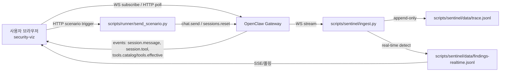

# End-to-End AI Agent 보안 가시화 (COONTEC Co., Ltd.)

  
  

---

## 목차

1. [OpenClaw (대상 에이전트)](#openclaw-대상-에이전트)
2. [SSOT](#ssot)
3. [빠른 시작](#빠른-시작)
4. [구성 요약](#구성-요약)

---

## OpenClaw (대상 에이전트)

🦞 Personal AI Assistant · [github.com/openclaw/openclaw](https://github.com/openclaw/openclaw)

OpenClaw는 LLM을 기반으로 실제 작업을 수행하는 오픈소스 AI Autonomous Agent입니다.

| 영역 | 설명 |
|------|------|
| 추론·의사결정 | 다양한 LLM을 활용합니다. |
| 도구 실행 | LLM이 선택한 **tool**로 셸 명령, API 호출 등을 자동 수행합니다. |
| 메모리 | 실행 행동이 **Memory**에 쌓여 **컨텍스트**를 유지하고, 장기·복잡 작업을 이어 갑니다. |

에이전트가 툴로 작업을 진행하기 때문에, **오판이나 악의적 지시**로 인해 시스템 손상·보안 위협이 생길 수 있습니다. 이 저장소는 OpenClaw 게이트웨이를 대상으로 **추적(trace)·규칙 기반 탐지(findings)·읽기 전용 가시화**를 묶은 보안 데모/MVP입니다.

---

## SSOT

**단일 출처(Single Source of Truth).** 시나리오 기본 프롬프트는 UI와 러너가 동일해야 합니다. 한쪽만 수정하면 재현이 어긋납니다.

| 시나리오 | UI (`scenarioRegistry.ts`) | Runner (`send_scenario.py`) |
|----------|----------------------------|-----------------------------|
| S1 | `S1_DEFAULT_SCENARIO_MESSAGE` | `S1_DEFAULT_MESSAGE` |
| S2 | `defaultMessage` (S2 항목) | `S2_DEFAULT_MESSAGE` |
| S3 | `S3_DEFAULT_SCENARIO_MESSAGE` | `S3_DEFAULT_MESSAGE` |

시나리오 본문·절차의 SSOT는 각각 `scenarios/s1-plugin-supply-chain.md`, `scenarios/s2-data-leakage.md`, `scenarios/s3-api-abuse.md`이며, 인덱스는 [scenarios/catalog.yaml](scenarios/catalog.yaml)입니다.

---

## 빠른 시작

1. **Python (Sentinel / runner)**  
   [scripts/README.md](scripts/README.md) — venv, `pip install -r scripts/requirements.txt`, `PYTHONPATH=scripts` 로 `ingest` / `detect` / `respond` / `send_scenario` 실행.

2. **대시보드 (security-viz)**  
   저장소 루트에서 `./run-viz.sh`를 실행합니다. OpenClaw 게이트웨이를 시작·재시작한 뒤, `OPENCLAW_GATEWAY_WS_URL`과 `OPENCLAW_GATEWAY_TOKEN`이 설정되어 있으면 Sentinel ingest와 Vite dev 서버를 함께 띄웁니다.  
   `Ctrl+C`로 종료하면 Sentinel ingest와 Vite는 종료되고, OpenClaw 게이트웨이는 `[Y/n]` 프롬프트에 따라 유지하거나 `openclaw gateway stop`으로 종료할 수 있습니다.  
   수동 실행: `cd security-viz && npm install && npm run dev` — 브라우저에서 WebSocket URL·토큰·세션 키를 입력합니다.  
   S1 시나리오 카드의 **플러그인 설치**는 `mock-malicious-plugin`(플러그인 id: `ai-image-toolkit`)을 설치하고 `plugins.allow` / `plugins.entries`를 보정한 뒤 `openclaw gateway restart`까지 수행합니다. **플러그인 제거**는 확장 디렉터리와 `entries` / `installs` / `allow`에서 해당 id를 정리합니다.  
   탐지 결과는 **Monitoring** 탭에서 확인합니다.  
   대시보드에서 실제 로딩되는 정적 이미지 위치는 `security-viz/public/photo/`입니다.

3. **S1 랩 플러그인**  
   [mock-malicious-plugin/README.md](mock-malicious-plugin/README.md) — 공급망 시나리오용 **랩 전용** 목업 플러그인입니다.

---

## 환경 변수

`run-viz.sh`와 `scripts/`에서 자주 쓰는 핵심 변수입니다.

| 변수 | 용도 | 필수 여부 | 기본값 / 예시 |
|------|------|-----------|---------------|
| `OPENCLAW_GATEWAY_WS_URL` | OpenClaw 게이트웨이 WebSocket 주소 | 필수(`ingest`, `send_scenario`, 정책 질의 등) | 예: `ws://127.0.0.1:14158/` |
| `OPENCLAW_GATEWAY_TOKEN` | 게이트웨이 인증 토큰 | 필수(`ingest`, `send_scenario`, 정책 질의 등) | 환경별 발급값 |
| `OPENCLAW_GATEWAY_SESSION_KEY` | 구독/주입 대상 세션 key | 선택(대시보드 기본 연결), 일부 스크립트에선 필수 | `run-viz.sh` 기준 `agent:main` (Vite 전달), 보통 `agent:main:main` 사용 |
| `SENTINEL_AUTO_ABORT` | 실시간 high+ finding 시 자동 `sessions.abort` | 선택 | `run-viz.sh` 기본 `1` |

---

## 구성 요약

### 시나리오

- 디렉터리: `scenarios/`
- 카탈로그: [scenarios/catalog.yaml](scenarios/catalog.yaml)
- 활성 시나리오: **S1** 악성 플러그인 공급망 · **S2** README 프롬프트 인젝션(데이터 유출) · **S3** API 남용 / Denial of Wallet

### Python `scripts/`

| 구성요소 | 역할 |
|----------|------|
| `scripts/openclaw_ws.py` | 게이트웨이 WebSocket 클라이언트 (`connect`, RPC, 이벤트) |
| `scripts/sentinel/ingest.py` | 구독·정규화·append-only `data/trace.jsonl`, `tools.effective` / `tools.catalog` 스냅샷 |
| `scripts/sentinel/detect.py` | `RealTimeCombinedDetector`(율·패턴 룰, `ingest.py`가 사용). 악성 MD 시그니처는 [vigil-llm](https://github.com/deadbits/vigil-llm)(Apache-2.0) YARA 카테고리 정규식 포팅 + 한국어 보강 ([scripts/sentinel/README.md](scripts/sentinel/README.md)) |
| `scripts/runner/chat_stream.py` | 화이트리스트 기반 도구 차단 + `.md` 파일 읽기 사전 검사(`md_signatures.yaml`). 시그니처 매칭 시 즉시 `sessions.abort` 호출하고 `findings-realtime.jsonl`에 `md-signature-block` 기록 |
| `scripts/sentinel/respond.py` | 알림·`findings-latest.json`, 조건부 `sessions.abort` |
| `scripts/runner/send_scenario.py` | `OPENCLAW_GATEWAY_*` 로 접속해 `chat.send` 등 시나리오 주입 |
| `scripts/runner/toggle_guardrail.py`, `check_plugin.py` | 러너 보조 스크립트 ([runner/README.md](scripts/runner/README.md)) |
| `scripts/requirements.txt` | `websockets`, PyYAML, `httpx`, `cryptography`, `pytest` |

### `security-viz/`

React/Vite: 게이트웨이 **읽기 전용** 구독, 타임라인·단계 패널, Sentinel findings 폴링·SSE.

- 시나리오 탭은 `scenarioRegistry.ts`의 `defaultMessage`만 사용합니다(변형 프롬프트 없음).
- 실행 흐름 패널: S1·S2·S3에서 탐지·차단 맥락이 잡히면 헤더에 `BLOCKED` 배지를 표시합니다.

---

## 아키텍처 흐름

---

## 데모 한계 및 주의사항

- 본 저장소는 **교육/랩 데모(MVP)** 목적입니다. 실서비스 보안 통제로 그대로 사용하지 마세요.
- 탐지는 룰 기반이므로 **오탐/미탐**이 발생할 수 있습니다. 운영 환경에서는 로그·정책·휴먼 리뷰와 함께 검증이 필요합니다.
- S1 mock 플러그인은 **공급망 시나리오 재현용**입니다. 내부 테스트 외 배포/재사용을 권장하지 않습니다.
- 자동 차단(`SENTINEL_AUTO_ABORT`)은 데모 편의 기능입니다. 운영 적용 전에는 영향 범위(세션 중단, 사용자 경험)를 반드시 점검하세요.