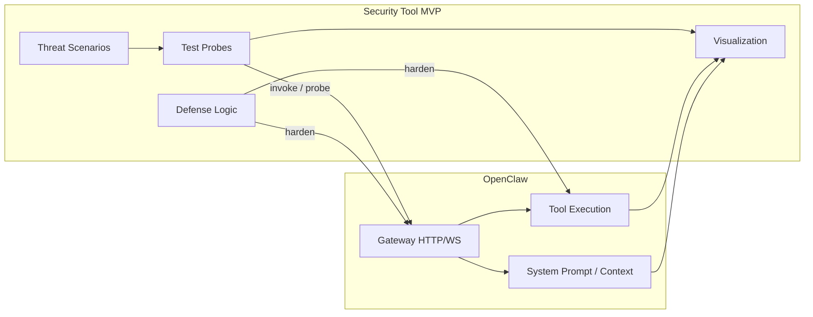

# End to End AI Agent 보안 가시화 기술 개발 with COONTEC Co., Ltd.

# Target Agent
## 🦞 OpenClaw — Personal AI Assistant

github : https://github.com/openclaw/openclaw

OpenClaw는 LLM을 기반으로 실제 작업을 수행하는 오픈소스 AI Autonomous Agent입니다.  
주요 기능은 다음과 같습니다:

- 다양한 LLM을 활용하여 **추론·의사결정**을 내립니다.
- LLM이 선택한 **tool**을 이용해 실제로 shell 명령 실행, API 호출 등 여러 작업을 자동으로 수행합니다.
- 에이전트가 실행한 모든 행동은 **Memory에 저장**되어, context을 유지하며 장기적이고 복잡한 작업도 가능합니다.

이처럼 OpenClaw는 LLM의 판단에 따라 선택된 툴로 작업을 진행하기 때문에,  
**잘못된 판단이나 악의적인 명령에 의해 시스템 파일이 삭제되거나 보안 위협이 발생할 수 있는** 위험을 내포하고 있습니다.

**우리는 사용자가 OpenClaw를 더욱 안심하고 사용할 수 있도록,  
취약점 스캔 및 LLM 오판 방어 기능을 갖춘 보안 기술(MVP)을 개발하고자 합니다.**

아래는 **Security Tool MVP**와 **OpenClaw 런타임**의 관계 목표이다.

---

# Git-flow 전략
Git-flow를 사용했을 때 작업을 어떻게 하는지 살펴보기 전에 먼저 Git-flow에 대해서 간단히 살펴보겠습니다.
Git-flow에는 5가지 종류의 브랜치가 존재합니다. 항상 유지되는 메인 브랜치들(master, develop)과 일정 기간 동안만 유지되는 보조 브랜치들(feature, release, hotfix)이 있습니다.

master : 제품으로 출시될 수 있는 브랜치
develop : 다음 출시 버전을 개발하는 브랜치
feature : 기능을 개발하는 브랜치
release : 이번 출시 버전을 준비하는 브랜치
hotfix : 출시 버전에서 발생한 버그를 수정 하는 브랜치
Git-flow를 설명하는 그림 중 이만한 그림은 없는 것 같습니다.

위 그림을 일반적인 개발 흐름으로 살펴보겠습니다.
처음에는 master와 develop 브랜치가 존재합니다. 물론 develop 브랜치는 master에서부터 시작된 브랜치입니다. develop 브랜치에서는 상시로 버그를 수정한 커밋들이 추가됩니다. 새로운 기능 추가 작업이 있는 경우 develop 브랜치에서 feature 브랜치를 생성합니다. feature 브랜치는 언제나 develop 브랜치에서부터 시작하게 됩니다. 기능 추가 작업이 완료되었다면 feature 브랜치는 develop 브랜치로 merge 됩니다. develop에 이번 버전에 포함되는 모든 기능이 merge 되었다면 QA를 하기 위해 develop 브랜치에서부터 release 브랜치를 생성합니다. QA를 진행하면서 발생한 버그들은 release 브랜치에 수정됩니다. QA를 무사히 통과했다면 release 브랜치를 master와 develop 브랜치로 merge 합니다. 마지막으로 출시된 master 브랜치에서 버전 태그를 추가합니다.

좀 더 자세한 설명을 보시려면 [‘A successful Git branching model’](http로 가시면 보실 수 있습니다.

출처 : https://techblog.woowahan.com/2553/

---

# 커밋 메시지의 7가지 규칙
제목과 본문을 빈 행으로 구분한다.
제목은 50글자 이내로 제한한다.
제목의 첫 글자는 대문자로 작성한다.
제목 끝에는 마침표를 넣지 않는다.
제목은 명령문으로 사용하며 과거형을 사용하지 않는다.
본문의 각 행은 72글자 내로 제한한다.
어떻게 보다는 무엇과 왜를 설명한다.

## 커밋 메시지 구조
Header, Body, Footer는 빈 행으로 구분한다.
Header는 필수이며 스코프는 생략 가능하다.
타입은 해당 커밋의 성격을 나타내며 아래 중 하나여야 한다.

| 타입 이름  | 내용                                         |
|:---------|:--------------------------------------------|
| feat     | 새로운 기능에 대한 커밋                        |
| fix      | 버그 수정에 대한 커밋                          |
| build    | 빌드 관련 파일 수정 / 모듈 설치 또는 삭제에 대한 커밋    |
| chore    | 그 외 자잘한 수정에 대한 커밋                   |
| ci       | ci 관련 설정 수정에 대한 커밋                   |
| docs     | 문서 수정에 대한 커밋                           |
| style    | 코드 스타일 혹은 포맷 등에 관한 커밋             |
| refactor | 코드 리팩토링에 대한 커밋                        |
| test     | 테스트 코드 수정에 대한 커밋                     |
| perf     | 성능 개선에 대한 커밋                           |

**Body**는 Header에서 표현할 수 없는 상세한 내용을 적는다.

**Header**에서 충분히 표현할 수 있다면 생략 가능하다.

**Footer**는 바닥글로 어떤 이슈에서 왔는지 같은 참조 정보들을 추가하는 용도로 사용한다.
예를 들어 특정 이슈를 참조하려면 Issues #1234 와 같이 작성하면 된다.
Footer는 생략 가능하다.

출처 : https://velog.io/@chojs28/Git-%EC%BB%A4%EB%B0%8B-%EB%A9%94%EC%8B%9C%EC%A7%80-%EA%B7%9C%EC%B9%99