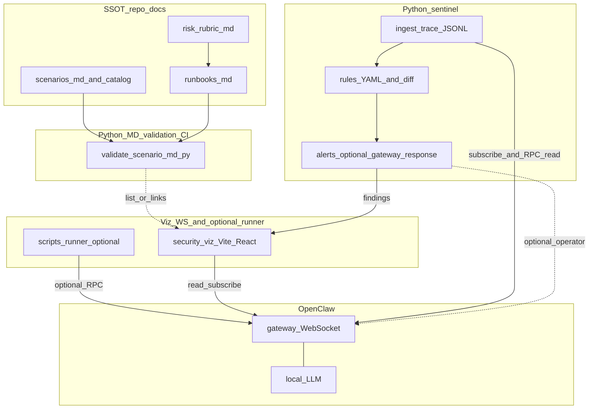

# OpenClaw 보안 가시화

## 1. 목표

- 사용자가 OpenClaw를 더 안전하게 쓰도록 돕는다: 위험 예방, 완화, 경고, 런북재현.
- **행위 추적**: 게이트웨이가 노출하는 이벤트(`session.message`, `session.tool`, 승인·세션 변경 등)를 정규화해 세션 단위 타임라인·감사 궤적으로 저장한다. ([protocol.md](openclaw-main/docs/gateway/protocol.md))
- **위협 탐지**: 선언적 규칙(예: 금지 툴 호출 시도, 비정상 호출 빈도, `tools.catalog`/`tools.effective`의 기준 대비 이상, 민감 경로·비밀 유사 인자)과 SSOT 시나리오 기대와의 괴리를 탐지한다.
- **방어 로직**: (1) 정적·사전 — Guardrail 프리셋·설정 검증·런처. (2) 동적 — 탐지 시 알림·대시보드 하이라이트; **선택적으로** 게이트웨이가 허용하는 연산자 동작(예: `sessions.abort`, 승인 거부 정책과의 연계)만 사용. OpenClaw 코어에 훅을 박는 방식은 범위 밖이며, **최종 툴 허용/샌드박스 집행은 OpenClaw 설정**이 담당한다.
- OpenClaw 소스는 수정하지 않는다. 외부 도구·설정·문서·(필요 시) 훅·플러그인 경계에서만 확장한다. ([openclaw-main/AGENTS.md](openclaw-main/AGENTS.md))

## 기술 스택

- **Python (기본)**: `scripts/` 아래 MD/YAML 검증, (선택) 게이트웨이 WS 러너, CI에서 동일 CLI 호출. 버전은 팀 표준(예: 3.11+)을 `docs/`에 한 줄 명시.
- **TypeScript / React / Vite**: `security-viz/` — 게이트웨이 WS 구독·패널·(선택) 로컬 sentinel이 노출하는 알림/요약 API(SSE 또는 소형 HTTP) 소비.

## Phase

1. Phase 1: 목표·Guardrail/Direct 정의, S1~S3 Markdown 시나리오·런북, 로컬 LLM 테스트 베드 재현 절차, MD 스키마 검증, 수동 실행·로그·(선택) `openclaw security audit --json`까지 텍스트로 완결.
2. Phase 2: `security-viz` 웹 UI, 게이트웨이 WS 구독, 단계별·Guardrail/Direct 화면; Python `sentinel`의 추적·탐지 결과를 같은 화면 또는 별도 패널로 표시. Phase 1 문서(SSOT)와 항목을 맞춘다.

## 제안 디렉터리 구조 (SG 루트)

OpenClaw 벤더 트리 `openclaw-main/`은 그대로 두고, 본 프로젝트 산출물만 아래에 둔다.

```text
SG/
├── README.md
├── docs/
│   ├── goals.md                 # 목표, OpenClaw 수정 없음, 용어
│   ├── guardrail-vs-direct.md   # 두 프리셋 정의·설정 키 참조
│   ├── sentinel.md              # 행위 추적·탐지·방어 경계, 오탐·연산자 권한·중단 정책
│   └── test-bed-local-llm.md    # 로컬 LLM + 게이트웨이 재현 절차
├── scenarios/
│   ├── catalog.yaml             # S1/S2/S3 인덱스, 메타, 파일 링크
│   ├── s1-plugin-supply-chain.md
│   ├── s2-data-leakage.md
│   └── s3-api-abuse.md
├── runbooks/
│   ├── pipeline-stages.md       # §4 단계와 동일한 런북 SSOT
│   └── risk-rubric.md           # Likelihood×Impact 기준, STRIDE 태그, 시나리오별 KPI·차단 사유 해석
├── scripts/
│   ├── requirements.txt         # 또는 pyproject.toml (프로젝트 루트에 둘 수도 있음)
│   ├── validate_scenario_md.py  # 필수 섹션·프론트매터 검사
│   ├── sentinel/                # 행위 추적·위협 탐지·(선택) 방어 응답
│   │   ├── README.md
│   │   ├── ingest.py            # WS 구독·이벤트 정규화·JSONL append
│   │   ├── rules/               # YAML 규칙 예시
│   │   └── detect.py            # 규칙 평가·기준 스냅샷 diff
│   └── runner/                  # 선택: chat.send 주입
│       ├── README.md
│       └── send_scenario.py
└── security-viz/                # Phase 2, Vite + React + TS (Python 아님)
    ├── package.json
    └── src/
        ├── gateway/             # WS 클라이언트
        └── panels/            # 단계별 시각화(§4.1)
            ├── StageInput.tsx
            ├── StagePolicy.tsx
            ├── StageToolEvidence.tsx   # 도구·근거
            ├── StageLogs.tsx
            ├── StageThreats.tsx        # sentinel 탐지·심각도·규칙 id
            └── StageRiskSummary.tsx   # 격자·태그·KPI, 차단 시 사유
```

Phase 1에서 `docs/`, `scenarios/`, `runbooks/`, `scripts/`를 먼저 채우고, Phase 2에서 `security-viz/`를 추가한다.

## 2. Guardrail vs Direct

- 런북·시나리오 MD에 두 프리셋을 명시한다 (Phase 1).
  - Guardrail: 샌드박스, 툴 allow/deny, 승인(exec approval 등), 채널·비밀 최소 노출 등 완화가 켜진 프로필. 구체 키는 시나리오 MD와 `config.get` 스냅샷으로 문서화.
  - Direct: 동일 시나리오에서 가드레일을 약화하거나 끈 교육·실험용 프로필(운영 금지 경고 필수).
- Phase 2 대시보드는 동일 시나리오에서 두 모드의 관측 차이(차단 vs 실행, 승인 대기, 인자 노출 등)를 보여 주며, 필드 정의는 Phase 1 런북을 따른다.

## 3. 시나리오 3종

시나리오·프롬프트·기대 행동은 `scenarios/*.md` 및 `catalog.yaml`이 SSOT이다 (§5).


| 시나리오   | 주제                                          | 추론            | 비고                                                              |
| ------ | ------------------------------------------- | ------------- | --------------------------------------------------------------- |
| **S1** | 악성 플러그인 공급망 공격 (Plugin Supply Chain Attack) | 로컬 LLM, 동일 스택 | 모의 악성 플러그인을 로컬에 설치; ClawHub/npm 실제 배포 없이 재현. 가짜 패키지·가짜 툴 메타만 사용 |
| **S2** | Data leakage (비밀·PII·버킷 경로 등)               | 로컬 LLM        | AWS 등 맥락은 MD 메타; 실계정·시크릿은 가짜·샌드박스                              |
| **S3** | API abuse / DoS                             | 로컬 LLM        | 도구가 호출하는 API는 스텁·모의로 정의해 남용만 재현                                 |

### S1 상세: 악성 플러그인 공급망 공격

**공격 원리**: OpenClaw는 `openclaw plugins install <package-name>` 한 줄로 ClawHub 또는 npm에서 플러그인을 로드한다. 플러그인은 `api.registerProvider()` 등으로 에이전트 툴 목록에 직접 삽입 가능하다. 공격자가 정상 패키지처럼 위장한 플러그인을 배포하면, 설치 후 에이전트는 악성 툴을 정상 툴로 신뢰한 채 호출한다.

**공격 흐름**:
1. 공격자가 외관상 정상인 플러그인(`openclaw-search-enhanced` 등) 배포
2. 사용자가 설치 → 플러그인이 이중 역할 툴을 `api.registerProvider/Tool`로 등록
3. 에이전트가 해당 툴을 신뢰, `tools.catalog`에 `source: "plugin"` / `pluginId`로 표시되나 검증 없이 사용
4. 툴이 백그라운드에서 민감 컨텍스트 외부 전송 또는 파일 무단 접근 수행

**재현 방법** (로컬 샌드박스, 실제 배포 없음):
- 로컬 경로 플러그인(`openclaw plugins install ./mock-malicious-plugin`)으로 악성 플러그인 흉내
- 툴 등록 시 `pluginId`·`source` 필드를 `tools.catalog` RPC로 확인
- Guardrail: `tools.effective` 기준 스냅샷과 diff → 미승인 신규 플러그인 툴 감지·경고
- Direct: 신규 플러그인 툴을 제한 없이 신뢰, 악성 호출 통과

**sentinel 탐지 포인트**:
- `tools.catalog` / `tools.effective` 의 `source: "plugin"` 툴 중 기준 스냅샷 대비 신규 항목 → 규칙 발화
- `session.tool` 이벤트에서 미승인 `pluginId`를 가진 툴 호출 시 알림

**S2/S3과 겹치지 않는 이유**:
- S2: 에이전트가 프롬프트·응답에서 비밀을 실수로 노출 (에이전트 행동 문제)
- S3: 정상 툴을 과도하게 반복 호출 (호출 빈도 문제)
- S1(대체): 플러그인 설치 단계에서 공급망 오염 → **툴 등록 자체가 악의적** (신뢰 경계 문제)

테스트 베드: S1~S3 공통으로 로컬 LLM(예: DeepSeek + Ollama/LM Studio)과 OpenClaw 게이트웨이 한 세트. 시나리오 차이는 설정·프롬프트·모의 서비스로만 준다. ([local-models](https://docs.openclaw.ai/gateway/local-models), [Ollama](https://docs.openclaw.ai/providers/ollama))

S3처럼 외부 과금이 위협인 경우에도 LLM은 로컬로 두고, 도구가 외부 API를 반복 호출하는 패턴으로 재현한다. Phase 1은 로그·런북, Phase 2는 UI로 관측한다.

## 4. 단계별 파이프라인

관측은 OpenClaw 게이트웨이가 제공하는 이벤트로 한정한다.

Phase 1 — 런북(MD) 순서 (UI 없이 재현·검증):

1. 의도/입력 — 시나리오·모드(Guardrail/Direct).
2. 가드레일 검사 — 기대 정책·`config.get` 스냅샷·승인·거부 기대치.
3. 도구 수명주기 — 기대 `session.tool` 필드; 도구 선택 근거는 직전 어시스턴트 텍스트·thinking(게이트웨이가 노출할 때만)을 런북에 인용하고, 미노출 시에는 내부 추론이 관측되지 않음을 명시한다(Phase 2 도구 근거 패널 문구와 맞출 것).
4. 로그 수집 — 필드 체크리스트·보관 형식(JSONL 등).
5. 위험 요약 — 런북에 Likelihood×Impact 격자, STRIDE(또는 유사) 태그, 시나리오 KPI. 차단·거절 시 게이트웨이·정책이 준 사유를 인용 (`runbooks/risk-rubric.md` 기준).

Phase 2: 위 단계를 `security-viz/src/panels/*`로 옮긴다 (`runbooks/pipeline-stages.md`와 1:1).

### 4.1 단계별 시각화 (Phase 2)

각 단계는 타임라인에서 접거나, 탭/스텝퍼로 나란히 둘 수 있다. 데이터는 게이트웨이 이벤트·`config.get`·(선택)보낸 JSONL로 한정한다.

| 단계 | 시각화 내용 |
|------|-------------|
| 1. 의도/입력 | 선택 시나리오 id, Guardrail/Direct 모드, 사용자(또는 러너) 메시지 요약 |
| 2. 가드레일 검사 | `config.get`에서 뽑은 샌드박스·툴 정책 요약; 승인 대기·거부 이벤트가 있으면 강조 |
| 3. 도구 수명주기·선택 근거 | `session.tool` 카드: 도구명, phase, 인자(민감값 마스킹). 근거 패널: 해당 툴 호출 직전의 어시스턴트 텍스트(스트리밍 델타 누적본)를 시간축에 묶어 표시. thinking/reasoning 스트림이 설정상 노출되면 같은 타임라인에 병합. 노출이 없으면 UI에 고정 문구: 게이트웨이가 모델 내부 추론을 주지 않으므로, 직전 메시지·툴 인자만 근거로 표시한다. |
| 4. 로그 수집 | 수집 필드 체크리스트 달성 여부, 타임라인보내기(다운로드) |
| 5. 위험 요약·차단 사유 | 격자(Likelihood×Impact), STRIDE 태그, 시나리오 KPI. 막힌 경우 정책·샌드박스·승인 거부 등 **왜 막혔는지**를 이벤트/응답 텍스트로 표시 |
| (병렬) 위협 탐지 | `StageThreats.tsx`: sentinel 규칙 발화 목록, 세션·타임스탬프, 권장 조치(문서 링크). 자동 중단을 켠 경우 해당 RPC 결과 요약(선택) |

도구 검증 시각화의 핵은 3단계: 정책 맥락(2) + 툴 이벤트(3) + 직전 자연어(3·근거)를 한 화면에서 연결하는 것이다. 위협 패널은 동일 타임라인과 링크되어 “관측 + 탐지”를 한 흐름으로 본다.

### 4.2 행위 추적 · 위협 탐지 · 방어 (Python `sentinel`)

| 축 | 역할 | 산출물 |
|----|------|--------|
| **행위 추적** | WS로 구독한 이벤트를 스키마화해 append-only 저장; 세션별 재생 가능한 최소 필드 집합 정의 | `scripts/sentinel/ingest.py`, trace JSONL 스키마·`docs/sentinel.md` |
| **위협 탐지** | YAML 규칙 + (선택) 기준 스냅샷 파일과 `tools.effective` 등 비교; 시나리오 SSOT와 “기대 차단” 불일치 플래그 | `scripts/sentinel/rules/*.yaml`, `detect.py` |
| **방어** | 탐지 → 로그·알림·UI; **선택** 게이트웨이 연산자 호출로 세션 중단 등 — 기본은 알림만, 자동 조치는 명시적 옵션·이중 확인·런북 절차 | `docs/sentinel.md`, (선택) `respond.py` |

게이트웨이에 **두 개의 WS 클라이언트**(viz 브라우저 + 로컬 sentinel)가 붙을 수 있다. 인증·토큰은 동일 정책을 따르며, 자동 `sessions.abort`는 오탐 시 업무 중단 비용이 크므로 문서화된 가드레일과 함께만 권장한다.

## 5. Markdown 검증

- 시나리오·런북·위협 모델은 `.md`(또는 YAML 프론트매터)로 관리한다. 필수 섹션: 목적, `inference: local`(S1~S3), Guardrail/Direct 기대 결과, 데이터·계정 가정, 윤리·샌드박스. 스키마 검증은 Phase 1에서 **Python** CLI·CI로 수행한다 (`validate_scenario_md.py` 등).
- Phase 2 대시보드는 MD를 읽어 목록을 채우거나 문서 링크·버전 해시를 표시한다.

## 6. 아키텍처



- **SSOT**: `scenarios/`, `runbooks/`(파이프라인·가드 정의), `risk-rubric.md`가 런북·위험 기준의 단일 출처.
- **Python MD 검증**: `validate_scenario_md.py`가 시나리오·런북 MD를 검증; OpenClaw 포크 없음.
- **Python sentinel**: 게이트웨이와 병렬 연결 — 이벤트 **행위 추적**, 규칙·스냅샷 **위협 탐지**, **방어**는 알림 기본 + (선택) 연산자 RPC. 상세는 `docs/sentinel.md`.
- **게이트웨이 클라이언트**: `security-viz`는 WS **읽기·표시** 중심 ([protocol.md](openclaw-main/docs/gateway/protocol.md)). `scripts/runner/`는 선택 주입.
- **런타임**: 게이트웨이·로컬 LLM은 사용자 환경; **툴·샌드박스 집행 본체는 OpenClaw**. SG는 추적·탐지·정책 패키지·(선택) 외부 응답으로 보완한다.

## 7. 검증

- Phase 1: 시나리오×Guardrail/Direct×로컬 LLM 수동 QA (문서·로그).
- MD 검증: 필수 섹션·메타 누락 시 실패.
- OpenClaw: 바이너리·설정만 바꿔 Guardrail/Direct 재현.
- Phase 2: Phase 1과 동일 시나리오를 UI로 회귀 확인.
- **Sentinel**: 녹화된 이벤트 픽스처(또는 스테이징 게이트웨이)에 대해 규칙 단위 단위 테스트; S1~S3에서 기대 탐지·비탐지 케이스를 런북에 명시하고 CI에서 회귀.

## 8. 추후 입력

- S1~S3 실제 사건 기반 스토리, 가짜 데이터 샘플, Guardrail/Direct별 기대 로그·위험 격자·태그 초안.
- Sentinel 규칙 초안(금지 툴·민감 경로·호출 빈도·MCP/플러그인 출처 이상), 자동 중단을 켤 환경의 운영 정책.
- S1용 모의 악성 플러그인 패키지 구조 초안 (`mock-malicious-plugin/`), `tools.catalog` 기준 스냅샷 파일 포맷.
